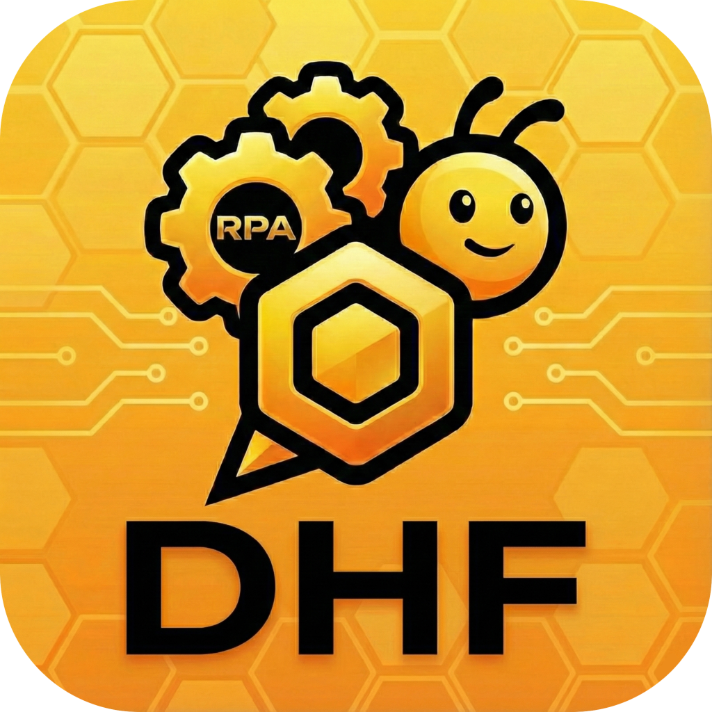

# DHF Bee Agent - Автоматизированный веб-агент на базе ИИ

[English](README.md) | [简体中文](README_CN.md) | [日本語](README_JA.md) | [Deutsch](README_DE.md) | [Français](README_FR.md) | [Español](README_ES.md) | [Português](README_PT.md) | [Русский](README_RU.md) | [한국어](README_KO.md)

**Платформа интеллектуальной автоматизации процессов нового поколения на базе ИИ, которая интеллектуально понимает и выполняет ваши бизнес-процессы.**

[Скачать DHF Bee Agent](https://dhf.pub/) | [Ключевые функции](#-ключевые-функции--key-features) | [Для кого это](#-почему-стоит-выбрать-dhf-agent--who-is-this-for) | [Экосистема MCP](#-взаимодействие-с-экосистемой-mcp)

---

## 🚀 Введение | Introduction

**DHF Bee Agent** — это революционный инструмент RPA (роботизированная автоматизация процессов) для браузеров. Он использует передовые технологии ИИ для понимания веб-страниц и помощи пользователям в создании автоматизированных рабочих процессов.

В отличие от других ИИ-агентов, DHF Bee Agent использует модель **«Создано ИИ, выполняется локально»**. После того как рабочий процесс создан, он преобразуется в эффективное выполнение фиксированного кода, **больше не потребляя токены**, обеспечивая как точность выполнения, так и нулевую стоимость. Независимо от того, являетесь ли вы офисным работником, желающим избавиться от повторяющегося труда, или разработчиком, ищущим эффективные веб-интерфейсы, DHF Bee Agent — ваш лучший партнер.

---

## 🎯 Почему стоит выбрать DHF Bee Agent? | Who is this for?

Мы адаптировали решения для различных групп:

### 1. 👩‍💼 Офисные работники и административный персонал (Office Workers)
**Попрощайтесь с повторяющимися кликами и сэкономьте время для творчества.**
*   **Проблема:** Ежедневное повторяющееся заполнение форм, сбор данных и нажатие кнопок в браузере.
*   **Решение DHF:** Скажите ИИ, что вы хотите сделать, и он автоматически сгенерирует процесс операции. С помощью встроенного **Планировщика задач** вы можете позволить компьютеру автоматически загружать отчеты или вводить данные поздно ночью и видеть результаты сразу, приходя на работу утром.

### 2. 👨‍💻 ИИ-гики и разработчики (Developers & Geeks)
**Высокоточное решение для веб-операций с нулевой стоимостью.**
*   **Проблема:** Веб-операции, управляемые исключительно LLM, потребляют много токенов и подвержены галлюцинациям и нестабильности.
*   **Решение DHF:** Используйте ИИ для помощи в написании скриптов Playwright. После успешной отладки последующие запуски потребляют **0 токенов**. Превратите неопределенные рассуждения ИИ в детерминированное выполнение кода, точное, надежное и бесплатное.

### 3. 🦄 Индивидуальные предприниматели и независимые разработчики (Solopreneurs)
**Один человек — это команда.**
*   **Проблема:** Нехватка ресурсов, высокая стоимость найма сотрудников.
*   **Решение DHF:** Создавайте разные роли агентов DHF (например, ассистент службы поддержки, оператор социальных сетей, финансовый специалист). Они как ваши цифровые сотрудники, выполняющие свои веб-задачи независимо в фоновом режиме, обеспечивая работу вашего бизнеса 24/7.

### 4. 🔗 Пользователи MCP и OpenClaw (Ecosystem Users)
**Супер-щупальце, соединяющее всё.**
*   **Проблема:** Большие модели не могут точно управлять веб-страницами, или стоимость операции слишком высока.
*   **Решение DHF:** Идеально поддерживает **MCP (Model Context Protocol)**. DHF Bee Agent может быть подключен как «рука» OpenClaw или других инструментов ИИ, преобразуя инструкции на естественном языке в точные действия Playwright, значительно экономя токены и повышая уровень успеха операций.

---

## ✨ Ключевые функции | Key Features

### ⚡ Повышение эффективности в 10 раз
Передайте утомительные и повторяющиеся веб-операции агенту DHF, чтобы добиться 10-кратного скачка эффективности. Пусть машины делают машинные дела, а люди — человеческие.

### 🧠 Управляемый ИИ и помощь в отладке
Попрощайтесь с утомительным кодом. ИИ интеллектуально помогает в создании и отладке рабочих процессов, позволяя естественному языку управлять построением процесса. Автоматизированная разработка никогда не была такой простой; даже если вы не знаете кода, вы можете начать.

### 💸 Нулевая стоимость выполнения (Zero Runtime Cost)
Это наше самое большое преимущество. После завершения отладки рабочий процесс может выполняться независимо без вмешательства ИИ. **Никаких постоянных затрат на токены API**, достижение реальной экономии.

### 🔒 Конфиденциальность прежде всего
Запускается полностью локально с зашифрованным хранением данных. Данные браузера, пароли учетных записей находятся на вашем собственном устройстве. У вас есть полный контроль для обеспечения абсолютной безопасности.

### 🌐 Взаимодействие с экосистемой MCP
Поддерживает стандартные протоколы MCP, беспрепятственно подключаясь к внешним экосистемам, таким как **n8n**, **Dify** и **OpenClaw**. Разрушьте изолированность приложений и создайте суперавтоматизированные рабочие процессы.

### 🤝 Обмен рабочими процессами
Поддерживает экспорт и обмен потоками задач в один клик. Превратите свой «опыт автоматизации» в файлы, чтобы поделиться ими с коллегами или сообществом, обеспечивая быстрое повторное использование возможностей.

### ⏱️ Интеллектуальное планирование задач
Встроенный профессиональный движок планирования Cron, поддерживающий настройку времени до секунды. Полностью автоматизируйте вашу периодическую работу (например, автоматическая отметка о приходе в 9 утра каждый день, автоматическая отправка еженедельных отчетов каждую пятницу).

---

## 🛠️ Техническая интеграция (For Developers)

DHF Bee Agent — это больше, чем просто инструмент; это инфраструктура.

*   **Как сервер MCP:** Вы можете подключить DHF Bee Agent в качестве сервера MCP для Cursor, Claude Desktop или других инструментов кода ИИ. Это дает вашему помощнику по программированию ИИ возможность напрямую управлять реальными браузерами.
*   **Конвертер Playwright:** Он может преобразовать нестабильные намерения на естественном языке в стабильные скрипты Playwright.
*   **API-триггер:** Поддерживает локальные вызовы API, легко интегрируясь в ваши существующие проекты Python/Node.js.

---

## 📥 Скачивание и установка | Download

Поддерживает Windows, macOS и Linux.

[**Нажмите здесь, чтобы скачать последнюю версию**](https://dhf.pub/)

---

## 🚀 Быстрый старт | Quick Start

1.  **Скачать и установить** DHF Bee Agent.
2.  **Создать задачу**: Нажмите «Новая задача» и введите целевой URL.
3.  **ИИ-запись**: Скажите ИИ в диалоговом окне «Помоги мне войти и скачать последний Excel с заказами», и ИИ автоматически сгенерирует шаги.
4.  **Сохранить и запустить**: Подтвердите правильность шагов и сохраните задачу. Установите таймер, и в будущем она будет работать автоматически за вас.

---

## Сообщество и поддержка

*   Отправить проблемы: [GitHub Issues](https://github.com/askie/dhf.pub/issues)

---

**DHF Bee Agent** - Redefining Browser Automation with AI.

---
